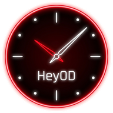
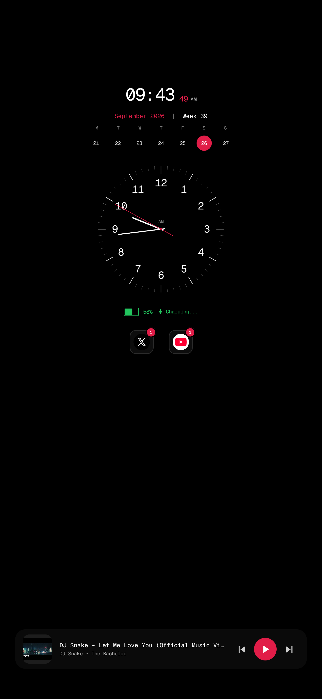
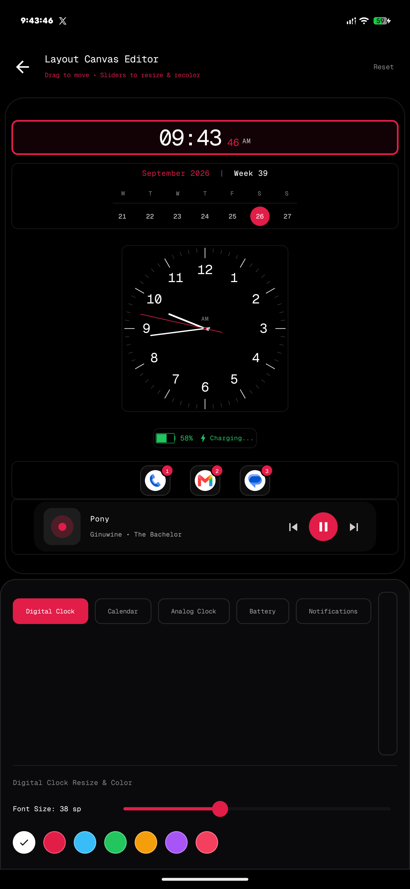
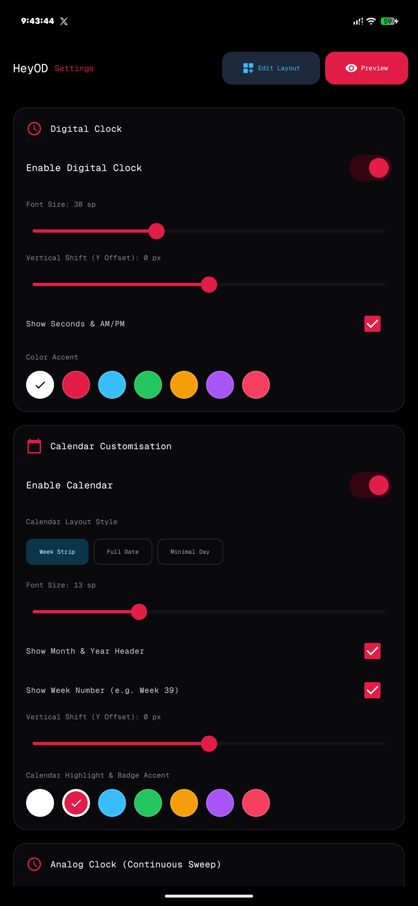

# HeyOD - Premium Always-On Display (AOD) for Android

<p align="center">
  
</p>

<p align="center">
  <b>A sleek, cyber-minimalist, AMOLED-optimized Always-On Display & Companion App engineered for Android.</b>
</p>

<p align="center">
  
  
  
  
  
</p>

---

## 📱 Screenshots

<p align="center">
  
  &nbsp;&nbsp;&nbsp;&nbsp;
  
  &nbsp;&nbsp;&nbsp;&nbsp;
  
</p>
<p align="center">
  <i>(Left: Live AOD on lockscreen &bull; Center: Drag-and-Drop Layout Canvas Editor &bull; Right: AMOLED Companion Settings)</i>
</p>

---

## ✨ Features

### 🕒 Ultra-Smooth Always-On Display
- **60 FPS Continuous Sweeping Analog Clock:** Real-time smooth sweep second hand with custom tick markers, Roman or modern numerals, and accent colors.
- **Glanceable Digital Clock & Date:** Crisp typography featuring monospace font styling with clean AM/PM indicators.
- **Week-Strip Calendar & Day Badges:** Customizable weekly horizon strip with current date highlights, week numbers (`W39`), and minimal date modes.
- **Vibrant Charging & Battery Status:** Live battery percentage and emerald green charging text (`⚡ Charging...`) with battery temperature and voltage monitoring.
- **Native System Notification Badges:** Shows active notifications using official, full-color system app icons (YouTube, WhatsApp, Gmail, Messages, etc.).

### 🎵 Live Music & Media Playback Controller
- **System Media Session Integration:** Listens to active media playback (`MediaSessionManager`) across any media app (Spotify, YouTube Music, Apple Music, Audible).
- **Playback Controls:** Fully interactive Play/Pause, Next Track, and Previous Track buttons directly on the AOD.
- **Live Metadata & Album Cover Art:** Displays current track title, artist, album name, and rendered album artwork (with *Pony* by Ginuwine as fallback).

### 🎨 Interactive Drag-and-Drop Layout Editor
- **Direct Canvas Manipulation:** Drag elements across the screen to position them anywhere.
- **Real-Time Resizing & Scaling:** Resize the analog clock diameter, digital clock, calendar strip, and notification badges with intuitive sliders.
- **Color Accent Picker:** Fine-tune accent colors across emerald green, electric cyan, vibrant amber, crimson red, and pure white.
- **One-Tap Reset:** Instantly revert to the balanced, professional default layout.

### 🔋 Battery & AMOLED Optimization
- **Pure AMOLED Pitch Black (`#000000`):** Pixels turn completely off on OLED displays, minimizing power consumption.
- **Pixel Burn-in Protection:** Subtle anti-burn-in orbital micro-shifting to safeguard OLED panels.
- **Unrestricted Battery Mode:** Built-in direct prompt to bypass OEM aggressive background task killers for 100% reliable lockscreen wakeups.
- **Native Screen Lock Integration:** Seamlessly triggers when the screen turns off or locks without requiring root.

---

## 🛠️ Tech Stack & Architecture

- **Architecture:** Clean Architecture + Modern Android Architecture Components (MVVM)
- **UI Toolkit:** Jetpack Compose + Custom Canvas 2D Rendering for high-frame-rate analog watch sweeps
- **Concurrency:** Kotlin Coroutines & StateFlow for reactive, non-blocking UI state
- **Preferences:** Jetpack DataStore / SharedPreferences for fast, atomic persistence
- **Media Engine:** Android `MediaSessionManager` & `MediaController`
- **Minimum SDK:** Android 10 (API Level 29)
- **Target SDK:** Android 14+ (API Level 34)

---

## 🚀 Getting Started

### Prerequisites
- Android Studio Ladybug / Iguana or later
- JDK 17+
- Android SDK with Build Tools 34.0.0+
- An Android physical device or emulator running Android 10+ (physical AMOLED device recommended for optimal experience)

### 📥 Clone & Build

```bash
# Clone the repository
git clone https://github.com/nissshh/HeyOD.git
cd HeyOD

# Build Debug APK
./gradlew assembleDebug
```

The compiled APK will be located at:
```
app/build/outputs/apk/debug/app-debug.apk
```

### 📲 Installation via ADB

Connect your Android device with USB Debugging enabled:

```bash
# Verify device connection
adb devices

# Install APK onto device
adb install -r -d app/build/outputs/apk/debug/app-debug.apk

# Launch HeyOD Companion Settings
adb shell am start -n com.nissshh.heyod/.ui.main.MainActivity
```

---

## 🔐 Permissions Setup

For complete functionality, HeyOD requires the following system permissions (prompts available directly in the companion app):

1. **Notification Access (`android.permission.BIND_NOTIFICATION_LISTENER_SERVICE`):** Required to fetch active notification icons and media session updates.
2. **Display Over Other Apps (`android.permission.SYSTEM_ALERT_WINDOW`):** Required to render the AOD over the lockscreen.
3. **Ignore Battery Optimizations (`android.permission.REQUEST_IGNORE_BATTERY_OPTIMIZATIONS`):** Ensures Android does not kill the AOD background service during sleep.

---

## 📄 License

```
Copyright 2026 HeyOD Project Contributors

Licensed under the Apache License, Version 2.0 (the "License");
you may not use this file except in compliance with the License.
You may obtain a copy of the License at

    http://www.apache.org/licenses/LICENSE-2.0

Unless required by applicable law or agreed to in writing, software
distributed under the License is distributed on an "AS IS" BASIS,
WITHOUT WARRANTIES OR CONDITIONS OF ANY KIND, either express or implied.
See the License for the specific language governing permissions and
limitations under the License.
```
